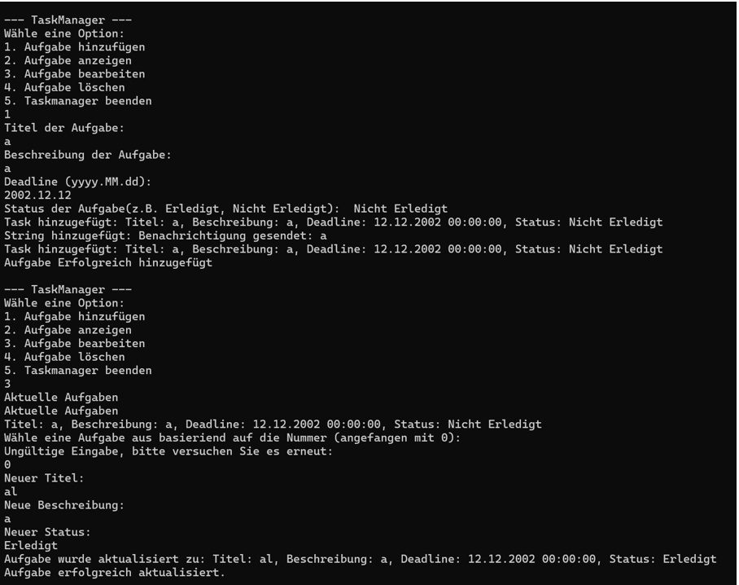

# Taskmanager

Hier sehen Sie meinen Taskmanager den ich während meiner Schulzeit programmiert habe. Mit dem Taskmanager kann man:

- Aufgaben erstellen
- Aufgaben löschen
- Aufgaben anzeigen
- Aufgaben bearbeiten

Programmiersprache:

- C#

